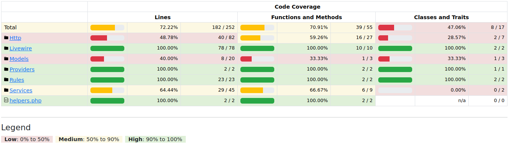

# Software Documentation

## 1. How to set up the project

### Installation Requirements
- Docker (Version used: 27.2.1)
- Docker compose (Version used: 2.29.5)

### Docker containers and versions
- Nginx
- PHP: 8.3
- MySQL: 8.4.0
- Redis
- Composer
- NPM: 18.20
- Artisan

### Code quality tools
- Pint
- PHPUnit

## Step 1: Clone the Repository
```bash
git clone https://github.com/jpoliveira08/covid-vaccination-control
```
Navigate into the project directory:
```bash
cd covid-vaccination-control
```

## Step 2: Set up the project environment variables
In this section, configure the project's environment variables. Simply adjust the credentials as desired or leave them as they are.
```bash
cp .env.example .env
```

## Step 3: Set up the laravel environment variables
```bash
cd app
```
You should also run the same command to copy the example .env laravel file.
```bash
cp .env.example .env
```
In this case, the following section will be modified from:
```bash
DB_CONNECTION=sqlite
# DB_HOST=127.0.0.1
# DB_PORT=3306
# DB_DATABASE=laravel
# DB_USERNAME=root
# DB_PASSWORD=
```
To this:
```bash
DB_CONNECTION=mysql
DB_HOST=mysql
DB_PORT=3306
DB_DATABASE=laravel
DB_USERNAME=root
DB_PASSWORD=
```

Add the credentials used in <strong>Step 2</strong> to this new .env file managed by Laravel.

## Step 4: Build the application
The first build probably will take some time...
```bash
docker compose build
```

Run the application
```bash
docker compose up -d
```

## Step 5: Install the Laravel app
To install the application, you must be in the covid-vaccination-control/ directory and run the following command:
```bash
docker compose run --rm composer install
```
Generate the project key
```bash
docker compose run --rm artisan key:generate
```

## Step 6: Run database migrations
```bash
docker compose run --rm artisan migrate
```
If you wish to populate data in the application, simply run the following seeders commands:
```bash
docker compose run --rm artisan db:seed EmployeeSeeder
```
```bash
docker compose run --rm artisan db:seed VaccineSeeder
```
```bash
docker compose run --rm artisan db:seed EmployeeVaccinationSeeder
```

## Step 7: Install frontend dependencies
```bash
docker compose run --rm npm install
```
```bash
docker compose run --rm npm run build
```

## Step 8: Access the application

#### If the FORWARD_NGINX_PORT variable was not modified, the application will be accessible at: http://localhost

#### If the FORWARD_NGINX_PORT variable was customized, the application will be accessible at: http://localhost:{FORWARD_NGINX_PORT}

### To run the tests cases, simply execute the command:
```bash
docker compose run --rm artisan test
```
Test coverage


## 2. Database structure
This database has been structured according to best normalization practices, ensuring data integrity. The image belows show the database diagram.


- The employees table stores information about each employee.

- The vaccines table holds information about each vaccine

- The employees_vaccinations table serves as a junction table between the employees and vaccines tables, recording each vaccination dose an employee receives

### Key Normalization Principles Applied:

<strong>1NF (First Normal Form):</strong> Each table (employees, vacinnes) has atomic columns without repeating groups, ensuring each field contains only one value per record. For instance, cpf in the employees table represent unique, single values for each employee.

<strong>2NF (Second Normal Form):</strong> All non-key fields are fully functionally dependent on the primary key of their respective tables.

## Application Overview

<p>
The application aims to register employee vaccinations. It has two CRUDs: one for vaccines and another for employees.</p>

<p>
The application has three main screens: Home, Employees, and Vaccines. In the Employees route, the user is also directed to different views based on the operation to be performed.
</p>

### Vaccines CRUD
<p>
Upon accessing the Vaccines screen, a table is presented to the user, which is built using PowerGrid and LiveWire.
</p>
<p>
In this table, the user can sort by columns (name and batch), and can also search records using the data present in these two columns. The table also features pagination.
</p>
<p>
The screen displays all the CRUD operation buttons. The insert button is located at the top, while the other actions for viewing, editing, and deleting are located in the last column of the table.
</p>
<p>
Since the vaccine registration has few fields, it was implemented using a Modal to enhance the system's usability, allowing the user to perform operations on the same screen where they view the records.
</p>

- Vaccine insertion rules
  - A modal is presented with the option to Save
  - All fields are required (HTML)
  - There is backend validation and messages are displayed with toast using the toastr library
    - The name must be in string format
    - The batch must be in string format
    - The expiration_date must be in date format (YYYY-MM-DD)
- Vaccine view rules
  - All inputs are disabled
- Vaccine editing rules
  - Follows the same rules as insertion

<p> The requests are made using vanilla JavaScript with the fetch API. </p>
<p> Since the onDeleteCascade is used in the vaccines and employees relationship table, if a vaccine that is related to an employee in the pivot table is deleted, the record is automatically removed from the pivot table. </p>

### Employees CRUD
<p>
When accessing the Employees screen, a table is also presented, built with PowerGrid and LiveWire.
</p>

<p>
In this table, the user can sort and search by columns (name and cpf), and like the vaccines table, it also features pagination.
</p>

<p>
The screen displays all the CRUD operation buttons. The insert button is located at the top, while the other actions for viewing, editing, and deleting are located in the last column of the table.
</p>

- Insertion Rules
    - The user can register the employee without a vaccine
    - The user can register the employee with one or more vaccines
    - The CPF is formatted while the user is typing
    - The CPF provided must not already exist in the database
    - In the employee section, the only optional field is "Has comorbidity"
    - There is validation on the frontend (HTML) and backend for the fields submitted
      - The name must be a string
      - The CPF must be a string and must be valid
      - The birthdate must be in date format (YYYY-MM-DD)
      - The "Has comorbidity" field is optional
    - If at least one vaccination has incomplete data, the registration will not be completed until it is corrected
    - The vaccine input is built with the virtual-select library
      - To search for vaccines, the user must type at least one character
      - The search is performed considering the fields name and batch
    - If multiple vaccine inputs are added in the HTML, but none are filled out, the record will only be saved with the employee data

- Viewing Rules
  - All inputs are disabled
  - In the employee section, the only optional field is "Has comorbidity"
  - There is validation on the frontend (HTML) and backend for the fields submitted
  - There is no submit button, only a button to return to the previous screen

- Editing Rules
    - The CPF is formatted while the user is typing
    - The user can only edit the vaccination data, not remove or add new on
    - The user can only add a vaccination if it has not been previously registered
    - There is validation on the frontend (HTML) and backend for the fields submitted
      - The name must be a string
      - The CPF must be a string and must be valid
      - The birthdate must be in date format (YYYY-MM-DD)
      - The "Has comorbidity" field is optional
      - If at least one vaccination has incomplete data, the update will not be performed until it is corrected
    - The vaccine input is built with the virtual-select library
      - To search for vaccines, the user must type at least one character
      - The search is performed considering the fields name and batch
    - If the employee has more than one vaccination record, all records must be displayed
<p>
In the registration process, to allow the registration of multiple vaccines at once, an implementation was made based on the behavior of the jQuery Repeater.
</p>

<p>
Since onDeleteCascade is used in the relationship table between vaccines and employees, if an employee that is related to a vaccine in the pivot table is deleted, the record is automatically removed from the pivot table.
</p>